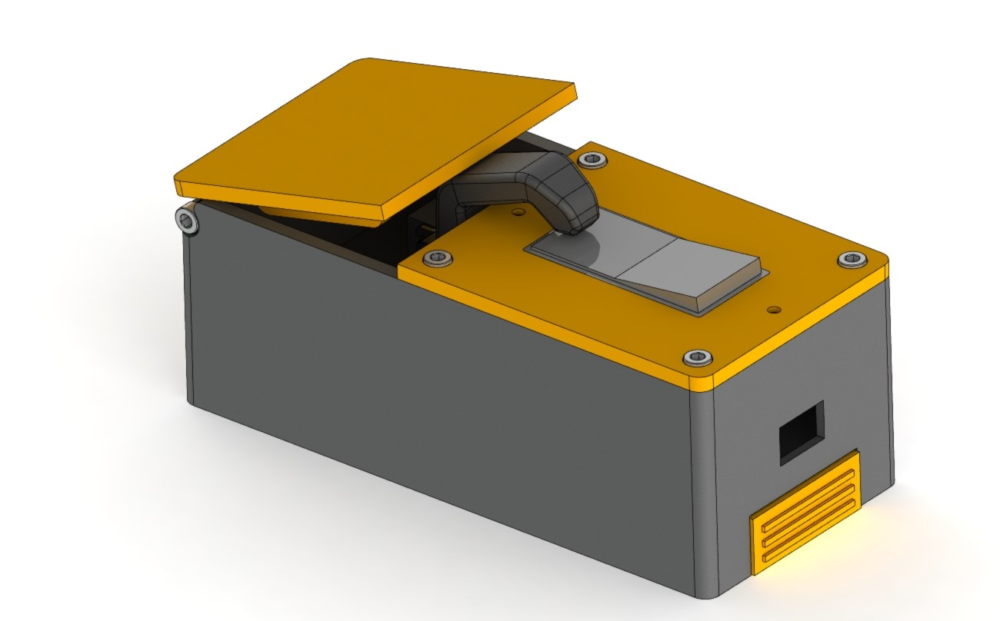

# Useless Box

A classic Useless Machine which operates it's own "off" switch.

## Overview

This repository contains the CAD, Arduino firmware, and circuit design to build the useless box featured in this video: https://www.youtube.com/watch?v=wQX75QZREI0

## Parts List

- Various 3d printed parts (in `./hardware`) printed in orange and black PLA
- Arduino Pro Micro + Breakout PCB (`./pcb`)
- Small LiPo battery
- M4 or M5 Socket Head Screw (for Hinge)

- 1x PCB ordered using Gerber files in (`./pcb`) -- 
- 1x Arduino Pro Micro
- 1x L7805CV 5V Linear Regulator
- 1x MG995 180 Degree Servo
- 1x 3-Pin JST-XH Connector (Female)
- 2x 2-Pin JST-XH Connector (Female)
- 2x 2-Pin JST-XH Connector (Male)
- 1x 2.54mm Male Pin Header

*Note: If you don't want to order a PCB, you can also build the circuit on a prototyping board yourself! Schematics in the same folder.*

## Build Instructions

1. Print all 3d-printed parts in any color/material. I used PLA, 30% infill, 0.2mm layer height.
2. Order PCB, or obtain a prototype board. (I won't go through circuit wiring instructions, check the PCB schematic in `./pcb`.)
2. Solder all components on the PCB